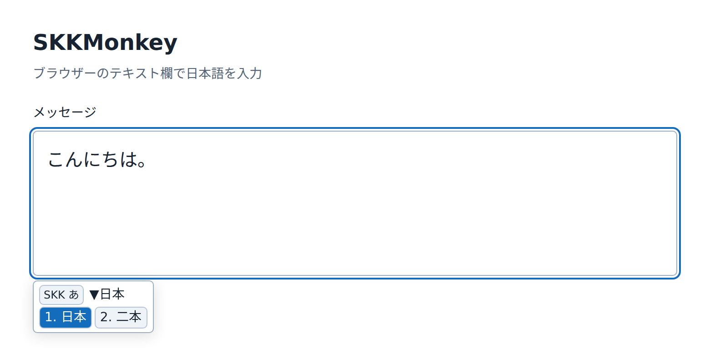
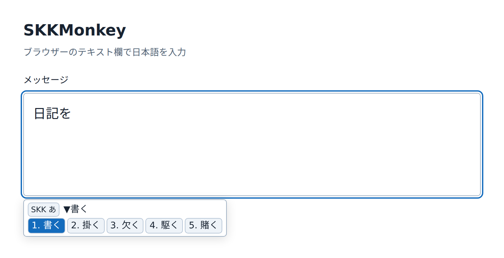

# SKKMonkey

A local SKK Japanese IME for Firefox and Chrome, written in Scala 3 and
compiled to JavaScript with Scala.js. Runs as a userscript; no server is required and typed text
is never sent over the network.

Inspired by [skkeleton](https://github.com/vim-skk/skkeleton), with its kana and
okuri tables. This is an independent implementation of core SKK, not a complete
skkeleton port.

## Install

1. Install [Tampermonkey](https://www.tampermonkey.net/) or
   [Violentmonkey](https://violentmonkey.github.io/).
2. Open [skk-ime.user.js](https://raw.githubusercontent.com/tani/skkmonkey/scala-js-rewrite/dist/skk-ime.user.js)
   and install it. If the manager does not offer installation, copy the entire
   file into a new script and save it.
3. Reload the page, focus a text field, and press **Ctrl+J**.
   Keep your OS IME in Latin/direct-input mode.
4. Type `Nihon`, press **Space**, then **Enter** to insert `日本`.

The script runs on HTTP/HTTPS pages. Restrict its `@match` rules in your manager
if desired. It requires page execution context; keep `@sandbox raw` and
`@inject-into page`. Browser-internal pages cannot run it.

## Usage examples

**Kanji conversion:** press **Ctrl+J**, type `Nihon`, then press **Space**.
The compact panel shows `日本` and alternative candidates. Press **Enter** to
insert the selected candidate into the text field.



**Okuri conversion:** type `Nikki`, **Space**, **Enter**, then `wo` and `KaKu`.
The field contains `日記を`, and `KaKu` automatically opens candidates such as
`書く`. Press **Enter** to finish `日記を書く`.



Screenshots use the built userscript and SKK-JISYO.L in a sample textarea in
Chromium, with userscript-manager APIs supplied by the browser fixture.

## Basic keys

| Key                      | Action                                                 |
| ------------------------ | ------------------------------------------------------ |
| Ctrl+J                   | Enter hiragana mode; confirm pending input             |
| Ctrl+Shift+Space         | Toggle ASCII / hiragana                                |
| Lowercase romaji         | Type kana directly                                     |
| Uppercase initial or `;` | Start conversion reading: `Kanji` → `▽かんじ`          |
| Uppercase inside reading | Start okuri: `KaKu` → `書く`                           |
| Space                    | Convert / next candidate                               |
| `x` during conversion    | Previous candidate                                     |
| Enter                    | Confirm                                                |
| Ctrl+G / Escape          | Return from candidates to reading, then cancel reading |
| Backspace / Ctrl+H       | Delete pending input                                   |
| `q`                      | Switch hiragana / katakana                             |
| `l` / `L`                | ASCII / fullwidth ASCII; Ctrl+J returns to hiragana    |
| `/`                      | Abbreviation mode: `/skk` + Space → `SKK`              |

Uppercase letters inside an unfinished romaji syllable continue that syllable.
Once the reading has completed kana, uppercase at a syllable boundary starts
okuri: `KAKu` behaves like `KaKu`, and `YOI` like `YoI`. This tolerates releasing
Shift late without disabling okuri conversion. Initial `NI` still becomes `に`;
pending `n` after a stem can become `ん` before okuri, as in `ShinDa`.

Use `n'` before a vowel or `y`: `kon'nichiha` → `こんにちは`.
The rule `nn` consumes both letters as `ん`.
The panel stays hidden while idle. Pending input appears in a compact floating
panel (at most two rows, up to 320 px wide) and enters the editor on confirmation.
Mode changes briefly show a badge; candidates scroll horizontally, and full text
and annotations are available on hover. Settings remain in the manager menu.
Moving the caret or leaving the field commits pending input.

## Dictionaries

[skk-dev/dict](https://github.com/skk-dev/dict)'s `SKK-JISYO.L` is declared as
`@resource`. Your userscript manager downloads and caches it during installation
or script updates. The script reads the cached bytes with `GM_getResourceURL`
and decodes EUC-JP locally; no dictionary request is made while typing.
If the resource cannot be read, the included small starter dictionary is used.

You can also import additional dictionaries through the manager menu
**SKK: 辞書設定 / Dictionary settings**. Imported candidates take priority over
SKK-JISYO.L; personal registrations and learned candidates take priority over both.

- UTF-8 and EUC-JP files are supported, up to 32 MiB. Import replaces the previous
  imported dictionary; SKK-JISYO.L and the starter fallback remain available.
- Unknown words or Space past the last candidate open registration. Enter the
  kanji stem with your OS IME or paste; okuri is appended automatically.
- Confirmed candidates are learned. Personal entries can be exported as SKK text.
- Dictionaries are stored locally by the userscript manager. Reload other tabs
  to pick up changes; simultaneous registration across tabs is not synchronized.
- Dictionary Lisp expressions and okuri-specific candidate blocks are skipped.

The full dictionary is downloaded by the manager, not embedded in the bundle.
SKK-JISYO.L is licensed under GPL-2.0-or-later; its copyright and license notices
remain in the cached upstream resource. Script updates refresh it according to
your manager’s resource update settings.

## Supported editors

Text/search inputs, textareas, ordinary `contenteditable`, and fields inside
open Shadow DOM are supported. Password, disabled, and read-only fields are
excluded. Add `data-skk-disable` to an element or ancestor to opt out.

Real component fixtures run the same scenarios on independently installed,
lockfile-pinned dependency profiles in Chromium and Firefox:

| Editor       | Legacy profile | Current profile |
| ------------ | -------------- | --------------- |
| Monaco       | 0.44.0         | 0.57.0          |
| CodeMirror 5 | 5.58.3         | 5.65.21         |
| CodeMirror 6 | 6.28.6         | 6.43.13         |
| ProseMirror  | 1.33.8         | 1.42.6          |
| Tiptap       | 2.11.5         | 3.31.4          |
| Quill        | 1.3.7          | 2.0.3           |

`current` is a fixed tested baseline, not an automatically moving latest version.
Profile manifests include the full dependency set for modular editors. Both
Monaco input modes are tested on the current profile when native EditContext is
available; the older profile uses its textarea input. These are tested points,
not a guarantee for every intervening release or custom configuration.

Component adapters update the editor model and undo history. Custom keymaps,
paste filters, collaboration, Monaco diff editors, and CodeMirror 5
contenteditable mode are not covered. Closed Shadow DOM and editors requiring
trusted native events are unsupported. Native undo for ordinary input elements
is not guaranteed. The panel is anchored to the field rather than the caret.

Halfwidth katakana, numeric conversion, AZIK/custom kana tables, skkserv,
dictionary completion, and recursive SKK registration are not implemented.
Tests use userscript-manager API shims; actual extension sessions and arbitrary
production websites have not been tested. See [VALIDATION.md](VALIDATION.md)
for the test matrix.

## Development

The `scala-js-rewrite` branch replaces the entire production TypeScript
implementation with **Scala 3.3.6 + Scala.js 1.19.0**. The SKK engine uses Scala
enums and case classes; dictionary entries use Scala collections. Browser
interop, UI, resource loading, persistence, bookmarks, and every editor adapter
are also implemented in Scala. There is no embedded or imported copy of the
old TypeScript runtime.

**Vite+ 1.0.0** remains the JavaScript packaging and editor-fixture toolchain.
sbt compiles and optimizes Scala.js to an ES module; Vite+ / Rolldown packages
it as a standalone IIFE with the userscript metadata. Browser users only need
the generated userscript, with no JVM or Scala runtime installation.

Requires **JDK 17+**, Node.js **22.18+ (22.x), 24.11+ (24.x), or 26+**, and npm.

```sh
npm ci
npx playwright install chromium firefox
npm run check
```

```sh
npm test                 # Scala.js MUnit tests executed in Node.js
npm run typecheck        # Scala compiler + Vite+ tool/configuration checks
npm run build            # Scala.js fullLinkJS + Vite+ userscript packaging
npm run test:browser     # Built userscript in Chromium and Firefox
npm run test:editors     # Current editor profiles, including fixture checks
npm run fmt              # JavaScript/TypeScript toolchain formatting
```

`scripts/scala.mjs` downloads a SHA-256-verified sbt 1.10.7 launcher to the
ignored `target/tooling/` directory. Scala dependencies come from Maven Central.
No global sbt or Scala installation is needed. Alternatively, an existing sbt
installation can run `sbt test fullLinkJS`, followed by `npx vp build`.
The linked module is generated under `target/userscript/`; the installable
artifact is `dist/skk-ime.user.js`. Run `npm run build` rather than `vp build`
alone after editing Scala sources.

`npm run check` runs Vite+ formatting/lint/type checks, Scala.js unit tests,
the optimized build, and browser/current-editor integration tests. The npm
lockfile pins Vite+ and fixture tooling; `build.sbt` and `project/` pin Scala,
Scala.js, sbt, and MUnit. Root npm dependencies remain only Vite+, Playwright,
and Node.js types. Editor packages remain isolated in their own profiles.

Production code lives under `src/main/scala/skk/`. Browser APIs and
version-specific page hooks are accessed through the Scala.js interop layer;
the engine and dictionary APIs are independent of DOM state. MUnit tests live
under `src/test/scala/skk/`. TypeScript is retained only for Vite+ configuration
and third-party editor fixtures; Node.js scripts drive builds and Playwright.

### Editor modules and version matrix

Production adapters live under `src/main/scala/skk/editors/<editor>/`.
Shared code lives in `editors/shared/`; ordinary fields in `editors/native/`. Monaco and CodeMirror 6 have
separate ordinary-input and EditContext modules. Quill 1 has a dedicated Delta
insertion module: its legacy paste handler requires a real browser paste, so
this module uses the container instance hook used by Quill.find. Quill 2 uses
clipboard events. No editor library is imported into the production bundle. Tiptap has its own entry point and
shares ProseMirror insertion. Version-specific implementations are added only
when tested behavior requires them; adapter selection uses DOM/capabilities.
`Bookmark.scala` manages bookmarks; `editors/Adapter.scala` defines the registry.

Each `test/editors/<editor>/` contains its fixture, `profiles.json`, and independent
`profiles/<name>/package.json`, `package-lock.json`, and `profile.json` files.
`test/editors/shared/scenarios.mjs` runs identical model/history/input assertions
on every profile. Profile builds resolve fixture dependencies only inside that
profile's node_modules, failing if a dependency would fall back to the root tree.

```sh
# List profiles; install their locked dependencies and run every profile.
npm run test:editors:matrix -- --list
npm run test:editors:matrix -- --install

# Run selected profiles, optionally on one browser.
SKK_TEST_BROWSERS=firefox npm run test:editors:matrix -- --install quill/legacy tiptap/current

# Reuse already installed profiles.
npm run test:editors:matrix -- monaco/legacy
```

`npm run test:editors` installs the six current profiles, checks their fixture
types with Vite+ / Oxlint, and builds the combined baseline fixture from those
profile trees. It does not maintain a second editor dependency set at the root.
`npm run typecheck:editors` runs the same installation and fixture type checks
without launching browsers. `test/editors/tsconfig.json` resolves fixture types
from the current profiles; `test/editors/oxlint.json` keeps that dependency scope
separate from the core checks. Legacy profiles are checked through browser tests.
GitHub Actions checks all profiles on both browsers for pushes, pull requests and
manual runs, with four jobs at a time. Reports are written to
`test-results/editor-matrix.json`; screenshots are separated by editor/profile
and browser, including failure screenshots. To add a version, copy a profile,
change its exact dependencies, regenerate its lockfile with `npm install`, add
it to `profiles.json` and the workflow matrix, then run the common scenarios.

The conversion engine lives in `Engine.scala`, browser integration in
`Userscript.scala`, and cached dictionary loading in `Resource.scala`.

## License

[MIT](LICENSE) for the implementation and starter dictionary.
Derived skkeleton kana/okuri tables retain their [zlib license](LICENSE.skkeleton).

The separately downloaded SKK-JISYO.L resource retains its upstream
GPL-2.0-or-later license and notices.
